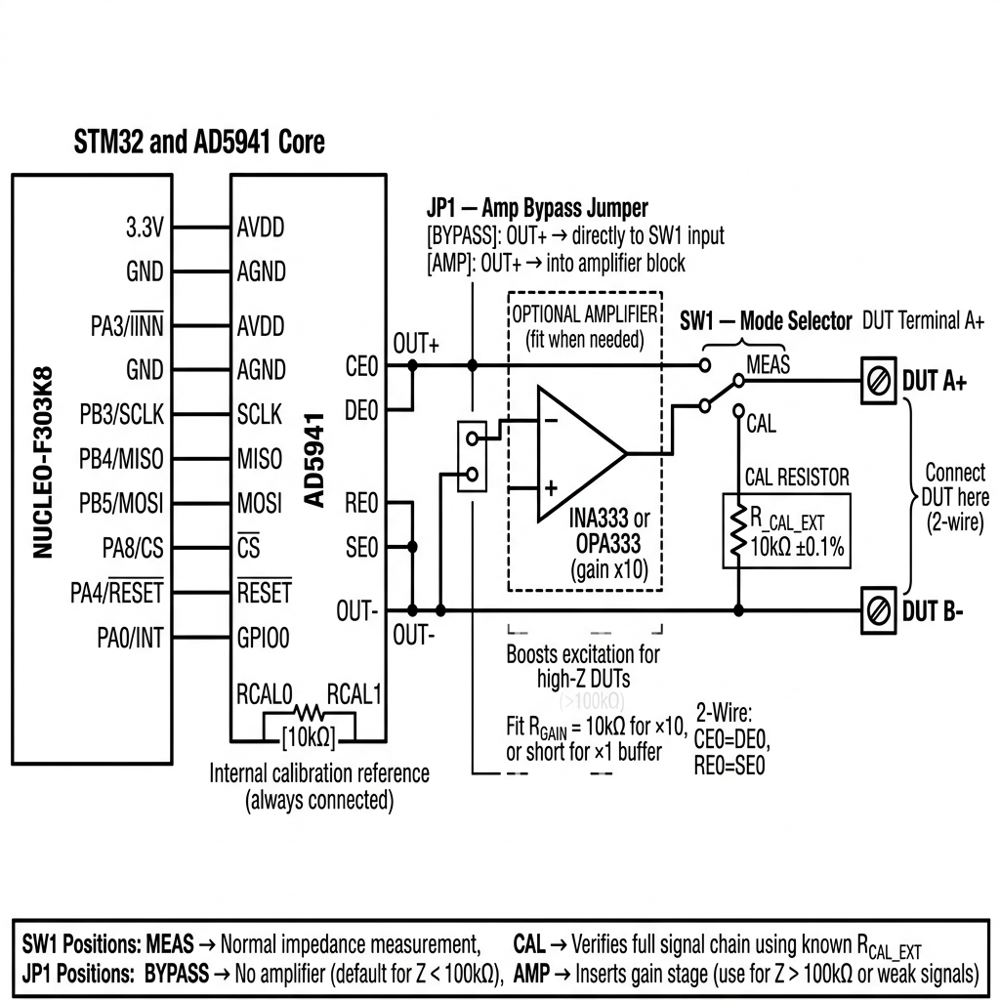

# AD5941 2-Wire Impedance Measurement System
### STM32F303K8 Nucleo-32 — Theory, Wiring, Calibration & Amplifier Paths



---

## 1. How Impedance is Measured — The EIS Principle

**Electrochemical Impedance Spectroscopy (EIS)** is the technique used to measure impedance. The core idea is simple:

> Apply a known AC voltage at a known frequency. Measure the resulting AC current. Divide voltage by current → you get impedance Z.

```
Z = V / I      (Ohm's Law, extended to AC signals)
```

But because we are dealing with AC signals, impedance is a **complex number** with two parts:
- **|Z|** — the magnitude (how large the impedance is, in Ohms)
- **Phase (φ)** — how much the current lags or leads the voltage (in degrees)
  - A pure resistor: Phase = 0°
  - A pure capacitor: Phase = −90°
  - An inductor: Phase = +90°
  - Real components: somewhere in between

To get a full picture of a DUT, you repeat this measurement across a **sweep of frequencies** (e.g., 1 Hz → 100 kHz). The resulting dataset is called an **impedance spectrum**.

---

## 2. How the AD5941 Works Internally

The AD5941 is a complete impedance measurement system on a single chip. It contains all the blocks needed to excite, measure, and calculate impedance:

```
┌─────────────────────────────────────────────────────────────────┐
│                          AD5941                                  │
│                                                                  │
│  ┌──────────┐   ┌──────────┐   CE0/DE0                          │
│  │   DDS    │──►│  DAC /   │──────────────► to DUT (excitation) │
│  │(waveform │   │  HSDAC   │                                     │
│  │generator)│   └──────────┘                                     │
│  └──────────┘                                                    │
│                                                                  │
│  RE0/SE0 ◄──── DUT return current                                │
│       │                                                          │
│  ┌────▼─────┐   ┌──────────┐   ┌──────────┐   ┌──────────────┐ │
│  │  HSTIA   │──►│ 16-bit   │──►│   DFT    │──►│  SPI result  │ │
│  │(TIA amp) │   │   ADC    │   │ engine   │   │  register    │ │
│  └──────────┘   └──────────┘   └──────────┘   └──────────────┘ │
│                                                                  │
│  RCAL0 ──[10kΩ]── RCAL1  (internal gain calibration)           │
└─────────────────────────────────────────────────────────────────┘
```

### Block-by-Block Explanation:

**DDS (Direct Digital Synthesizer)**
Generates a precise sine wave at the target frequency. The frequency, amplitude, and phase are all set via SPI registers by the STM32.

**HSDAC (High-Speed DAC)**
Converts the digital sine wave from the DDS into an analog voltage signal. This is the **excitation signal** that drives the DUT.

**HSTIA (High-Speed Transimpedance Amplifier)**
This is the heart of the measurement. The current returning from the DUT flows into the HSTIA, which converts it to a voltage:

```
V_out = I_dut × R_TIA
```

The `R_TIA` (feedback resistor) is selectable in firmware. Larger R_TIA → more sensitive to small currents → better for high-impedance DUTs.

**ADC (16-bit)**
Samples the HSTIA output voltage at high speed.

**DFT Engine (Discrete Fourier Transform)**
This is the key to accurate measurement. The DFT extracts only the **sine component at the excitation frequency** from the ADC samples — it effectively filters out all noise at other frequencies. It computes two numbers:
- **Real part (I)** of the signal at the target frequency
- **Imaginary part (Q)** of the signal at the target frequency

From these, it computes the complex impedance:
```
Z = (V_real + j·V_imag) / (I_real + j·I_imag)
|Z| = sqrt(real² + imag²)
Phase = atan2(imag, real) in degrees
```

**RCAL Path (Internal Calibration)**
Before measuring the DUT, the AD5941 routes the excitation through the known RCAL resistor (10kΩ). It measures the DFT result for a known impedance, then uses that as a reference to cancel out gain errors in the DAC and TIA chain:

```
Z_dut = Z_rcal × (DFT_dut / DFT_rcal)
```

This makes the measurement **ratiometric** — absolute errors in the hardware cancel out.

---

## 3. How the Full Circuit Works — Step by Step

Here is the complete signal flow from power-on to reading a result on your PC:

### Step 1 — Power On
The STM32 boots, initialises SPI1, and de-asserts the AD5941 RESET pin (PA4 HIGH). The AD5941 comes out of reset and is ready to receive SPI commands.

### Step 2 — Firmware Initialisation
The STM32 configures the AD5941 over SPI:
- Sets the excitation frequency sweep range
- Sets the excitation voltage amplitude
- Sets the HSTIA feedback resistor (R_TIA) for the expected impedance range
- Sets the number of DFT points (determines averaging / noise reduction)

### Step 3 — Calibration Measurement
The firmware triggers the AD5941 to measure through the RCAL resistor first. The DFT result is stored as `DFT_rcal`. This accounts for any gain drift in the hardware.

### Step 4 — DUT Measurement Loop
For each frequency step:
1. DDS sets frequency → DAC outputs sine wave → CE0/DE0 excites the DUT.
2. Current returns via RE0/SE0 into the HSTIA.
3. ADC samples the HSTIA output for N cycles.
4. DFT engine computes the real and imaginary components.
5. AD5941 asserts GPIO0 (falling edge) to interrupt the STM32 (PA0).
6. STM32 ISR sets the `ucInterrupted` flag.
7. Main loop reads the DFT registers over SPI.
8. Firmware computes `|Z|` and `Phase` using the RCAL reference.
9. Result is printed over UART to PuTTY on the PC.

### Step 5 — Output to PC
The STM32 sends each result line over USART2 (PA2 TX → Nucleo ST-Link VCP) at 38400 baud:
```
Freq=1000.0 Hz  |Z|=4721.3 Ohm  Phase=-12.4 deg
```

---

## 4. The External Signal Path — Calibration & Amplifier

Signal flows **left to right** from the AD5941 measurement pins through optional external stages to the DUT:

```
AD5941                                                     DUT
  OUT+  ──────►  [JP1]  ──────►  [AMP]  ──►  [SW1]  ──►  A+
  (CE0=DE0)      bypass/        optional      MEAS /
                 insert         gain x10      CAL

  OUT-  ──────────────────────────────────────────────►  B-
  (RE0=SE0)                    (return, no amplifier needed)
```

### JP1 — Amplifier Bypass Jumper

| JP1 Position | Effect |
|---|---|
| **BYPASS** (default) | OUT+ goes directly to SW1. Use for Z < 100kΩ. |
| **AMP** | OUT+ passes through an external op-amp gain stage first. Use for Z > 100kΩ or weak signals. |

**Amplifier recommendation:** OPA333 (zero-drift, ultra-low noise, 3.3V single supply) or INA333.
Configure gain with a single resistor: `Gain = 1 + (100kΩ / R_GAIN)`. For ×10: R_GAIN = 11.1kΩ.

> [!NOTE]
> The amplifier only goes in the **forward/excitation path**. The return path (OUT-) feeds directly into the AD5941's internal HSTIA, which is the TIA measurement stage — no external amplifier is needed or wanted there.

**Why not amplify the return path?**
Adding an amplifier on the return line would break the **virtual ground** that the HSTIA holds at its input. The HSTIA is specifically designed to be the only amplifier on that node.

**Amplifier noise:** Every gain stage adds noise. Use the calibration path (SW1 = CAL) with the amplifier in circuit to characterise and compensate for the amplifier's phase shift, especially at high frequencies (> 10 kHz).

### SW1 — Mode Selector Switch

| SW1 Position | Effect |
|---|---|
| **MEAS** | Signal goes to DUT terminal A+. Normal measurement mode. |
| **CAL** | Signal goes through external R_CAL_EXT (10kΩ ±0.1%), which loops back to OUT-. Verifies the full external signal chain including any amplifier. |

**Use CAL at startup**, before switching to MEAS. Compare the result to the known R_CAL_EXT value to verify the system is working correctly.

---

## 5. Bill of Materials (BOM)

| Ref | Component | Value / Part | Qty | Notes |
|---|---|---|---|---|
| U1 | AD5941 | AD5941BCPZ (48-LFCSP) | 1 | Main impedance front-end IC |
| MCU | Nucleo-32 | NUCLEO-F303K8 | 1 | STM32 dev board |
| C1–C3 | MLCC Capacitor | 100nF, 10V, X7R | 3 | Bypass caps: AVDD, DVDD, IOVDD |
| C4–C5 | MLCC/Electrolytic | 10µF, 10V | 2 | Bulk caps: AVDD, DVDD |
| C6–C7 | MLCC | 100nF | 2 | Bypass on VREF_1V82, DVDD_REG_1V8 |
| R1 | Metal film resistor | 10kΩ ±0.1% | 1 | RCAL (RCAL0–RCAL1) |
| R_CAL_EXT | Metal film resistor | 10kΩ ±0.1% | 1 | External calibration path via SW1 |
| U2 | Op-amp (optional) | OPA333 or INA333 | 1 | Forward path amplifier (JP1) |
| R_GAIN | Resistor (optional) | 11.1kΩ ±1% | 1 | Sets amp gain (×10) |
| JP1 | 3-pin header + jumper | — | 1 | Amp bypass jumper |
| SW1 | SPDT switch | Any small toggle | 1 | MEAS / CAL mode selector |
| J1 | Screw terminal | 2-position | 1 | DUT A+ / B- |
| — | USB cable | Micro-B | 1 | PC to Nucleo |
| — | Jumper wires | — | ~10 | Breadboard connections |
| — | Breadboard | Full-size | 1 | For prototyping |

---

## 6. PC Connection

The Nucleo-32 has an on-board **ST-Link V2** debugger that appears as two devices:

1. **ST-Link Debugger** — used by STM32CubeIDE to flash and debug.
2. **Virtual COM Port (VCP)** — carries UART2 data at **38400 baud, 8N1**.

### Steps:
1. Connect Nucleo to PC with a **Micro-B USB cable**.
2. Open **Device Manager** → *Ports (COM & LPT)* → note COM number (e.g., `COM5`).
3. Open **PuTTY**: Connection type = **Serial**, line = `COM5`, speed = `38400`.
4. Click **Open**, then press the **Reset button** on the Nucleo.

### Expected output (TEST_MODE = 1):
```
--- HW ALIVE ---
=== Impedance Board Self-Test ===
USART2 OK  : 38400 baud, 8N1
[   1000 ms] LED blinks: 2 | SPI RX: 0xAA
```

### Expected output (TEST_MODE = 0, AD5941 connected):
```
Freq=100.0 Hz    |Z|=10021.3 Ohm  Phase=-0.3 deg
Freq=215.4 Hz    |Z|=9998.7 Ohm   Phase=-0.1 deg
Freq=1000.0 Hz   |Z|=4721.3 Ohm   Phase=-12.4 deg
```

---

## 7. Power Supply Wiring

| AD5941 Pin | Connect to | Bypass Cap |
|---|---|---|
| AVDD | Nucleo 3V3 | 100nF + 10µF to GND |
| DVDD | Nucleo 3V3 | 100nF + 10µF to GND |
| IOVDD | Nucleo 3V3 | 100nF to GND |
| AGND | Nucleo GND | — |
| DGND | Nucleo GND | — |
| VREF_1V82 | (float, bypass only) | 100nF to AGND |
| DVDD_REG_1V8 | (float, bypass only) | 100nF to DGND |

> [!IMPORTANT]
> Place bypass capacitors **as close as possible** to the AD5941 pins. Long traces will cause noisy, unstable measurements.

---

## 8. SPI & Control Connections

| Nucleo Pin | Label | AD5941 Pin | Direction | Notes |
|---|---|---|---|---|
| PB3 | D13 | SCLK | STM32 → AD5941 | SPI clock |
| PB4 | D12 | MISO | AD5941 → STM32 | Data from AD5941 |
| PB5 | D11 | MOSI | STM32 → AD5941 | Data to AD5941 |
| PA8 | D7 | CS̄ | STM32 → AD5941 | Chip select, active low |
| PA4 | D3 | RESET̄ | STM32 → AD5941 | Active low reset |
| PA0 | A0 | GPIO0 | AD5941 → STM32 | Data-ready interrupt |

SPI Mode 0 (CPOL=0, CPHA=0), MSB first, up to 16 MHz.

---

## 9. 2-Wire Measurement Wiring

Short CE0↔DE0 and RE0↔SE0 with jumper wires or solder bridges:

```
AD5941 CE0 ─┐
             ├── wire ──► DUT Terminal A+
AD5941 DE0 ─┘

AD5941 RE0 ─┐
             ├── wire ──► DUT Terminal B-
AD5941 SE0 ─┘
```

> [!NOTE]
> 2-wire includes lead/contact resistance. Acceptable for DUTs above ~100Ω. For lower impedances, a 4-wire Kelvin connection would be needed.

---

## 10. Assembly Checklist

Before first power-on:

- [ ] AVDD, DVDD, IOVDD → 3.3V, each with 100nF bypass cap
- [ ] AGND, DGND → GND
- [ ] VREF_1V82 and DVDD_REG_1V8 → 100nF bypass caps to GND
- [ ] RCAL0–RCAL1 → 10kΩ ±0.1% resistor
- [ ] CE0 = DE0 (shorted) → Terminal A+
- [ ] RE0 = SE0 (shorted) → Terminal B-
- [ ] SPI: PB3→SCLK, PB4→MISO, PB5→MOSI, PA8→CS
- [ ] Control: PA4→RESET, PA0→GPIO0
- [ ] JP1 in BYPASS position (default, no amplifier)
- [ ] SW1 in CAL position for first power-on
- [ ] R_CAL_EXT (10kΩ) wired in calibration path
- [ ] USB Micro-B cable connected to PC
- [ ] PuTTY open at 38400 baud, correct COM port
- [ ] Flash `TEST_MODE 1` first → confirm `--- HW ALIVE ---` appears
- [ ] Then flash `TEST_MODE 0` with AD5941 connected
